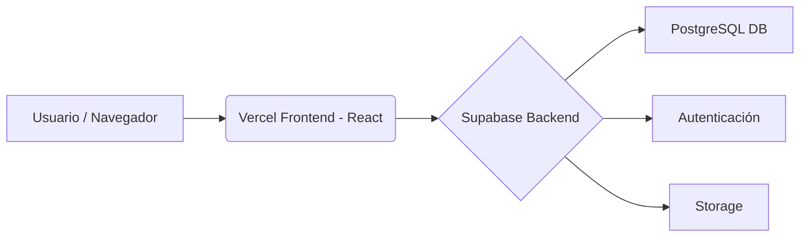

<div align="center">
  

  # Kinetic: Open-Source Fitness OS 🚀

  **Kinetic** es un sistema operativo integral para el seguimiento de tu actividad física, diseñado para ser rápido, limpio y completamente gratuito para desplegar. 
  
  [](https://vercel.com/new/clone?repository-url=https%3A%2F%2Fgithub.com%2FTU-USUARIO%2Fkinetic)
</div>

---

## 💡 ¿Por qué Kinetic?

La mayoría de las aplicaciones de fitness te cobran una suscripción mensual solo por registrar lo que comes o tus rutinas de gimnasio. Diseñé Kinetic como una alternativa **100% Open-Source** y gratuita. 

Puedes usarlo, aprender de su código, o desplegar tu propia instancia privada con cero costos de servidor.

---

## 🏗 Arquitectura del Proyecto

Kinetic utiliza un stack moderno y escalable que permite alojarlo gratuitamente:

- **Frontend (Vercel):** Construido con **React 19 + Vite + TypeScript**. Se despliega en la red global de Vercel para una velocidad extrema.
- **Backend y Base de Datos (Supabase):** Utiliza **Supabase** (PostgreSQL) para la autenticación segura, base de datos en tiempo real y almacenamiento (Storage).



---

## ✨ Características Principales

*   **🔒 Autenticación Segura:** Inicio de sesión vía Supabase (Google / Email) + *Modo Invitado*.
*   **🏋️‍♂️ Librería de Ejercicios:** Videos demostrativos optimizados en WebM.
*   **📊 Creador de Rutinas Visual:** Interfaz drag-and-drop para armar entrenamientos.
*   **📈 Dashboard Avanzado:** Estadísticas y progreso en tiempo real (Recharts).
*   **📱 Multiplataforma:** Listo para Web, iOS y Android (Capacitor).

---

## 🚀 Despliegue Rápido (Tu propio Kinetic)

Puedes tener tu propia instancia de Kinetic corriendo en 5 minutos:

1. Crea un proyecto gratuito en [Supabase](https://supabase.com/).
2. Ejecuta el archivo `database_setup.sql` en el SQL Editor de Supabase.
3. Haz clic en el botón de **Deploy to Vercel** de arriba e ingresa tus llaves de Supabase (`VITE_SUPABASE_URL` y `VITE_SUPABASE_ANON_KEY`) cuando se te solicite.

---

## 🛠 Instalación Local (Para Desarrolladores)

Si deseas modificar el código o contribuir:

1. Clona el repositorio:
   ```bash
   git clone https://github.com/TU-USUARIO/kinetic.git
   cd kinetic
   ```
2. Instala las dependencias:
   ```bash
   npm install
   ```
3. Configura tus variables de entorno:
   - Copia el archivo `.env.example` y renómbralo a `.env`.
   - Agrega tus credenciales de Supabase.
4. Inicia el servidor de desarrollo:
   ```bash
   npm run dev
   ```
   *La app estará disponible en `http://localhost:5173`.*

---

## 🤝 Contribuir

¡Las contribuciones, reportes de bugs y sugerencias son siempre bienvenidos! Únete a nuestra comunidad si deseas aportar nuevas ideas.

> ¿Necesitas un software a medida para tu negocio, gimnasio o clínica? [Contáctame aquí](https://tu-sitio-web-o-whatsapp.com) para servicios de desarrollo profesional.