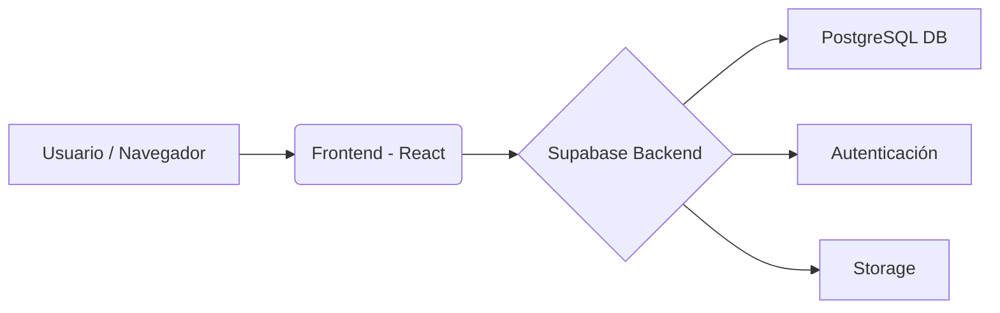

<div align="center">
  

  # Kinetic: Open-Source Fitness OS 🚀

  **Kinetic** es un sistema operativo integral para el seguimiento de tu actividad física, diseñado para ser rápido, limpio y construido por la comunidad. 
  
</div>

---

## 💡 Nuestra Misión

La mayoría de las aplicaciones de fitness te cobran una suscripción mensual solo por registrar lo que comes o tus rutinas de gimnasio. Kinetic nace como una alternativa **100% Open-Source** y gratuita. 

**Nuestro objetivo no es solo que copies esta app**, sino crear una comunidad de desarrolladores que colaboren para mejorarla. Queremos construir la mejor herramienta de fitness de código abierto, añadiendo nuevas funciones, optimizando el rendimiento y aportando ideas juntos.

---

## 🏗 Arquitectura del Proyecto

Kinetic utiliza un stack moderno y escalable:

- **Frontend:** Construido con **React 19 + Vite + TypeScript**.
- **Backend y Base de Datos:** Utiliza **Supabase** (PostgreSQL) para la autenticación segura, base de datos en tiempo real y almacenamiento (Storage).



---

## ✨ Características Principales

*   **🔒 Autenticación Segura:** Inicio de sesión vía Supabase (Google / Email) + *Modo Invitado*.
*   **🏋️‍♂️ Librería de Ejercicios:** Videos demostrativos optimizados en WebM.
*   **📊 Creador de Rutinas Visual:** Interfaz drag-and-drop para armar entrenamientos.
*   **📈 Dashboard Avanzado:** Estadísticas y progreso en tiempo real (Recharts).
*   **📱 Multiplataforma:** Listo para Web, iOS y Android (Capacitor).

---

## 🛠 Instalación Local (Para Colaboradores)

Si deseas unirte al proyecto y aportar tu código:

1. Haz un *Fork* y luego clona tu repositorio:
   ```bash
   git clone https://github.com/TU-USUARIO/kinetic.git
   cd kinetic
   ```
2. Instala las dependencias:
   ```bash
   npm install
   ```
3. Configura tus variables de entorno (necesitarás crear un proyecto gratuito en Supabase y ejecutar `database_setup.sql` en su SQL Editor para tener tu entorno local de pruebas):
   - Copia el archivo `.env.example` y renómbralo a `.env`.
   - Agrega tus credenciales locales/de prueba de Supabase.
4. Inicia el servidor de desarrollo:
   ```bash
   npm run dev
   ```
   *La app estará disponible en `http://localhost:5173`.*

---

## 🤝 Cómo Contribuir

¡Este proyecto está vivo gracias a la comunidad! Hay muchas formas en las que puedes ayudar a mejorarlo:

1. **Reportando Bugs:** Si encuentras un error o algo que no funciona bien en el diseño, abre un *Issue* describiendo el problema.
2. **Proponiendo Funciones:** ¿Tienes una idea genial? Abre un *Issue* para discutirla con los demás desarrolladores.
3. **Escribiendo Código:** Revisa los *Issues* abiertos y envía un *Pull Request* (PR) con tus mejoras. Toda ayuda es bienvenida, desde corrección de estilos CSS hasta integraciones complejas de backend.

> ¿Necesitas un software a medida para tu negocio, gimnasio o clínica? [Contáctame aquí](https://portafolio.alexsoto042.org) para servicios de desarrollo profesional.